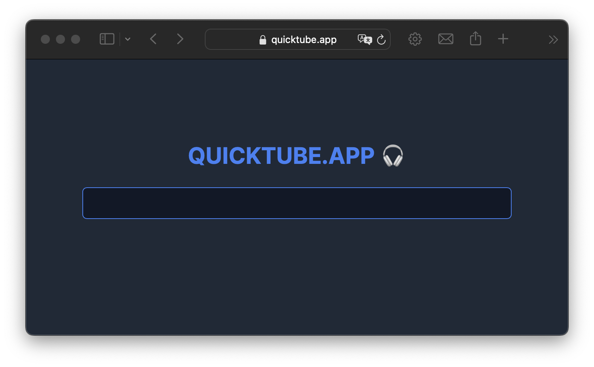

# QuickTube.app




<p align="center">
  <a href="https://quicktube.app/" _target="blank">quicktube.app</a>
</p>

<p align="center">Convert YouTube videos to MP3. No BS.</p>

<hr>

<div align="center">
  💎 Ruby 3.4 · 🛤 Rails 8 · ⚡️ Stimulus · 🅺 Kamal 2
</div>

<hr>

# Deploy

> [!NOTE]
> For Kamal v1 with Traefik, see [legacy v0.1.7.1](https://github.com/vladyio/quicktube/tree/v0.1.7.1).

First, you'll need to obtain a `cookies.txt` file to avoid bot checks coming from YouTube. Here's a
guide on how to do this: https://github.com/yt-dlp/yt-dlp/wiki/FAQ#how-do-i-pass-cookies-to-yt-dlp

Short version:

1. Install the `Get cookies.txt LOCALLY` extension (Chrome, Firefox)

2. Open an incognito window

3. Create a throw-away Google account, go to https://youtube.com/robots.txt

4. Choose "Current Site" from the  `Get cookies.txt LOCALLY` extension menu

5. With the `cookies.txt` that was loaded by extension run this command:

    `scp -P <SSH_PORT> config/cookies.txt <SSH_USER>@<HOST>:/rails/config/cookies.txt`

<hr>

1. Clone the repository
2. Install `kamal` (see [Kamal docs](https://kamal-deploy.org/docs/installation/)):

    `gem install kamal`
3. Create a `config/deploy.yml` file from sample:

    `cp config/deploy.yml.sample config/deploy.yml`
4. Set values in `config/deploy.yml` to match your setup
5.  Create a `.env` file from sample:

    `cp .env.sample .env`
6. Set values in `.env` to match your setup
7. Prepare server(s) - everything from copying an SSH key to setting up UFW, users and permissions:

   ```
   ./bin/prepare_server
   ```
8. Finally, deploy:

   ```
   kamal deploy
   ```

## Custom environments

It's possible to prepare & deploy a custom environment too.

Make sure you have a `config/deploy.[environment].yml` and `.kamal/secrets.[environment]` files.

For example, for a `staging` environment:

    ./bin/prepare_server staging

    kamal accessory boot redis -d staging
    kamal deploy -d staging.

